# 🎓 MY SYSTEM DESIGN — Plain English + Diagrams
## AI Campus Placement Agent

> **Who this is for:** You — the person who built this. Written so you can explain every part of the app to a judge without getting confused. No developer jargon without explanation.

---

## 1. 🌍 The Big Picture — What does this app actually do?

Think of the old way placement works in a college:

```
TPO reads every JD manually
   ↓
TPO manually checks which 200 students are eligible
   ↓
TPO emails students one by one
   ↓
TPO calls professors for interview rooms
   ↓
TPO makes the schedule in Excel
   ↓
Students call TPO asking "did I get in?"
   ↓
Everyone is stressed
```

**Your app replaces all of that with AI:**

```mermaid
flowchart LR
    A["🏢 Company posts\na Job Description"] --> B["🤖 AI reads it\nautomatically"]
    B --> C["✅ AI checks all\n200 students"]
    C --> D["📊 AI ranks the\nbest matches"]
    D --> E["👨‍💼 TPO reviews\n& approves"]
    E --> F["📅 System auto-schedules\ninterviews — no clashes"]
    F --> G["👨‍💼 TPO approves\nschedule"]
    G --> H["🔔 Students notified\nautomatically"]
    H --> I["📈 AI gives each\nstudent skill advice"]
```

**The key idea:** AI does all the grunt work. Humans approve at the important decisions.

---

## 2. 👥 Who Uses This App — The 4 Roles

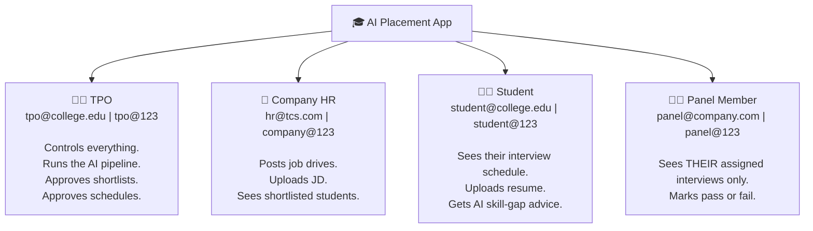

Each role sees a completely different dashboard. A student **cannot** see another student's data. A panel member can **only** mark results for interviews assigned to them.

---

## 3. 🗺️ Website Pages — Every Screen in the App

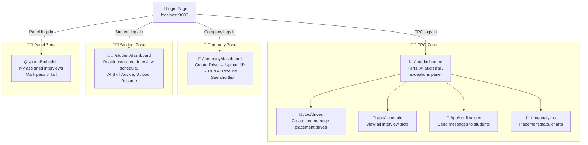

---

## 4. 🤖 The AI Pipeline — Step by Step

This is what happens when the Company clicks **"Run Pipeline"**:

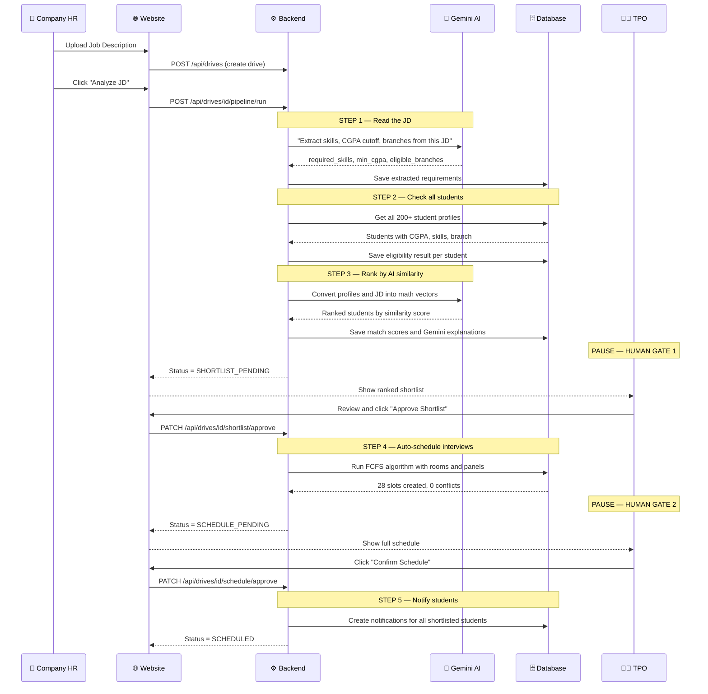

---

## 5. 🧠 How the AI Actually Works

### Part A — Reading the Job Description

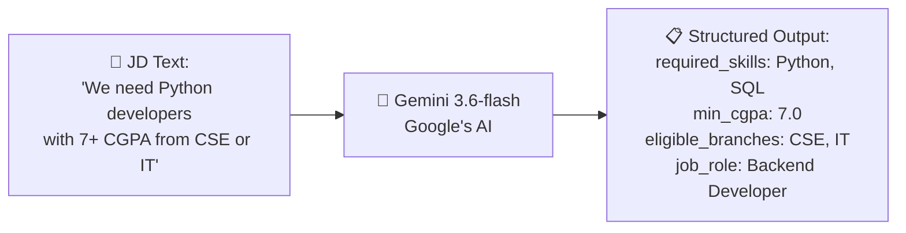

> **Plain English:** We paste the job description into Gemini and say "extract the requirements". It reads like a human and spits out a clean structure we can use in code.

---

### Part B — Finding Best Matches (Vector Search)

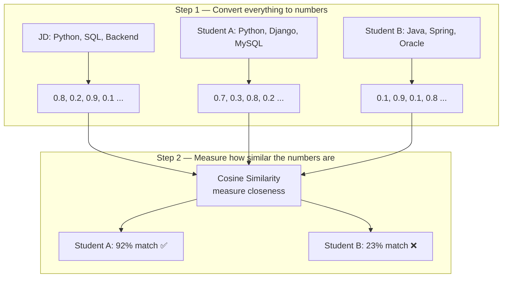

> **Plain English:** We convert both the JD AND every student profile into a list of numbers (called *embeddings*). Numbers that are close = similar meaning. So "Python developer" and "Backend engineer with Python" score similarly even though the exact words differ. That's why this beats simple keyword matching.

---

### Part C — Personalized Skill Advice

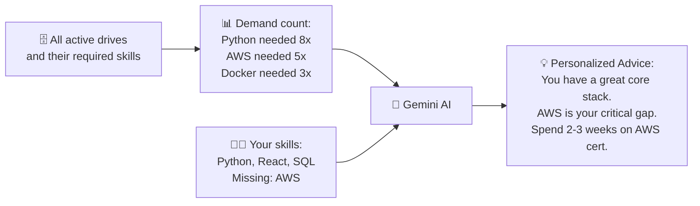

---

## 6. 📅 How Auto-Scheduling Works (FCFS Algorithm)

FCFS = **First Come First Served** — like booking a movie ticket.

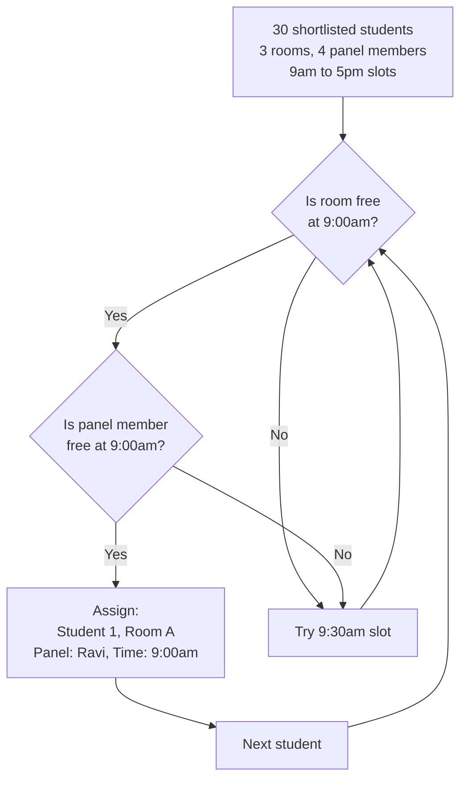

> **Result:** 30 students scheduled, zero double-bookings, done in under 1 second.

---

## 7. 🏗️ How the Code is Organized

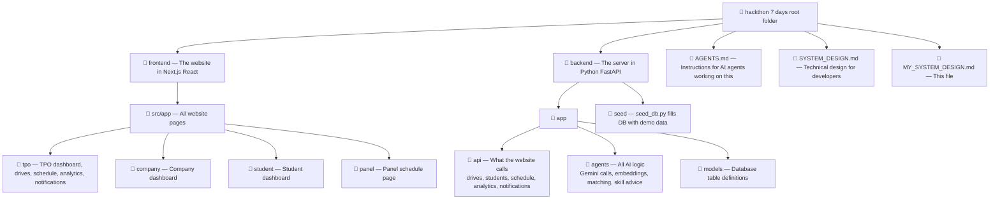

---

## 8. 🔐 How Login and Security Works

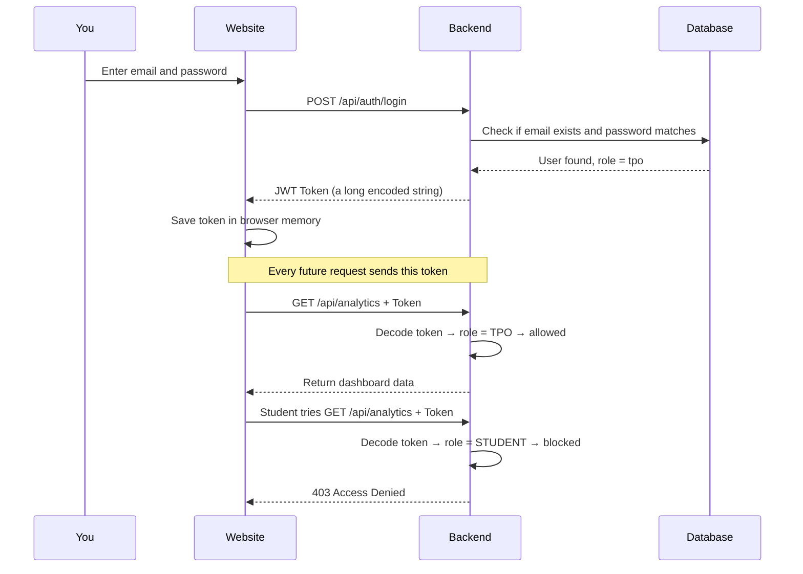

> **Plain English:** When you log in, the server gives you a "hall pass" (JWT token). You show it on every request. Wrong role = blocked. Students can't see TPO data. Panel members can only mark their own interviews.

---

## 9. 🔴 Live Updates — WebSocket

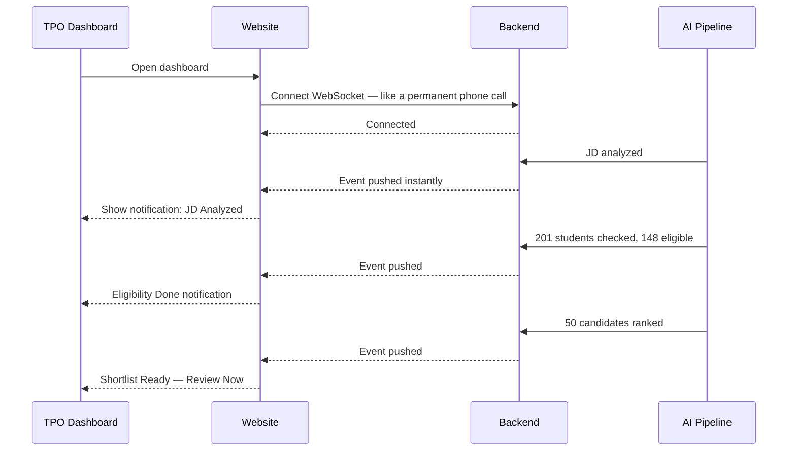

> **Plain English:** Normal websites work like texting — you ask, you wait, you get a reply. WebSocket is like a phone call that stays open — the server can talk to you anytime. That is how the TPO dashboard shows live updates while the AI pipeline is running.

---

## 10. 🗄️ What Gets Stored in the Database

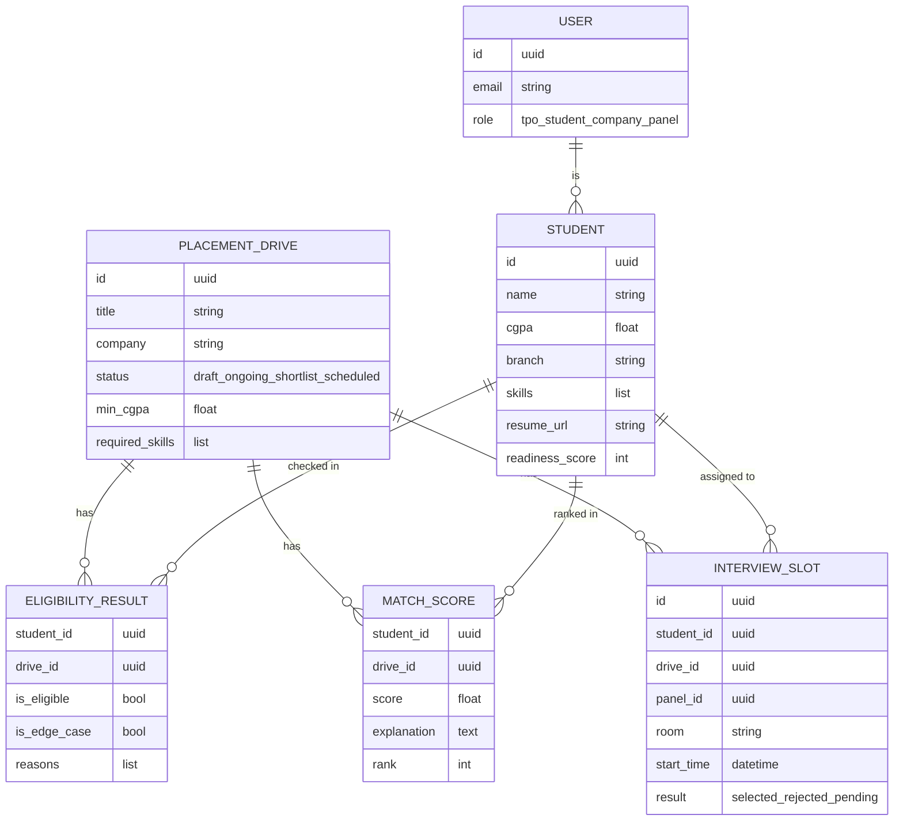

---

## 11. 🚀 How It Lives on the Internet (Deployment)

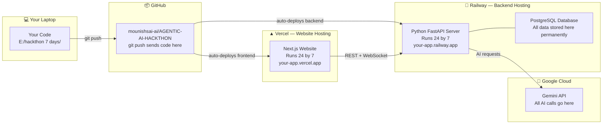

---

## 12. 🗺️ The Complete Judge Demo Flow

> *This is the path a judge walks through. Know every single step.*

```mermaid
flowchart TD
    Start(["Judge opens your app URL"])

    Start --> L["Login as Company\nhr@tcs.com / company@123"]
    L --> CD["Company Dashboard\nClick Create Drive"]
    CD --> JD["Paste Job Description\nClick Analyze JD"]
    JD --> Wait["Wait 30 to 60 seconds\nAI pipeline is running live"]
    Wait --> Result["201 students checked\n148 eligible, 50 ranked — REAL numbers"]
    Result --> Logout1["Logout"]

    Logout1 --> L2["Login as TPO\ntpo@college.edu / tpo@123"]
    L2 --> TD["TPO Dashboard\nSee the drive shortlist notification"]
    TD --> Rev["Click Review Shortlist\nSee ranked students with AI explanations"]
    Rev --> App1["Click Approve Shortlist\nHuman Gate 1 done"]
    App1 --> Sched["Go to Drives page\nCreate Round with real date and time\nAuto-Schedule runs instantly"]
    Sched --> App2["Click Confirm Schedule\nHuman Gate 2 done"]
    App2 --> Logout2["Logout"]

    Logout2 --> L3["Login as Panel\npanel@company.com / panel@123"]
    L3 --> PS["Panel Schedule\nSee their assigned interviews\nMark one as Selected"]
    PS --> Logout3["Logout"]

    Logout3 --> L4["Login as Student\nstudent@college.edu / student@123"]
    L4 --> SD["Student Dashboard\nSee interview slot, readiness score\nRead personalized AI Skill Advice"]
    SD --> End(["Demo complete\nFull flow, zero fake data, all real"])
```

---

## 13. ⚡ Quick Reference — What Talks to What

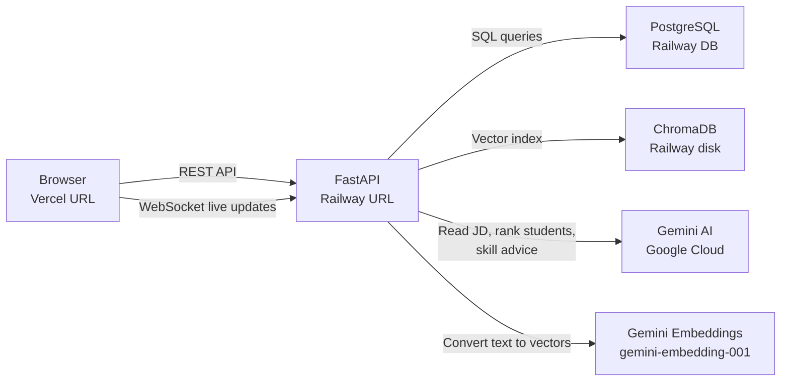

---

## 14. ❓ The One Honest Caveat — What AI Does vs Does Not Do

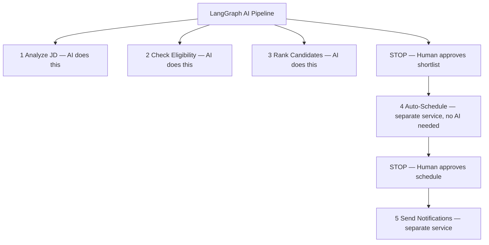

> **If a judge asks:** *"Does the AI agent keep running after the TPO approves?"*
>
> **Your honest answer:** *"The AI pipeline handles intelligence — reading the JD, checking eligibility, ranking candidates. Once the TPO approves, the scheduling system takes over as a separate service. We deliberately separated concerns: AI for intelligence, FCFS algorithm for scheduling, humans for decisions. That's a real production design pattern."*
>
> This is a **strength**, not a weakness. The AI does exactly what AI is good at.

---

*Created: 2026-08-23 | Written for you — so you can explain every box to any judge, confidently.*
